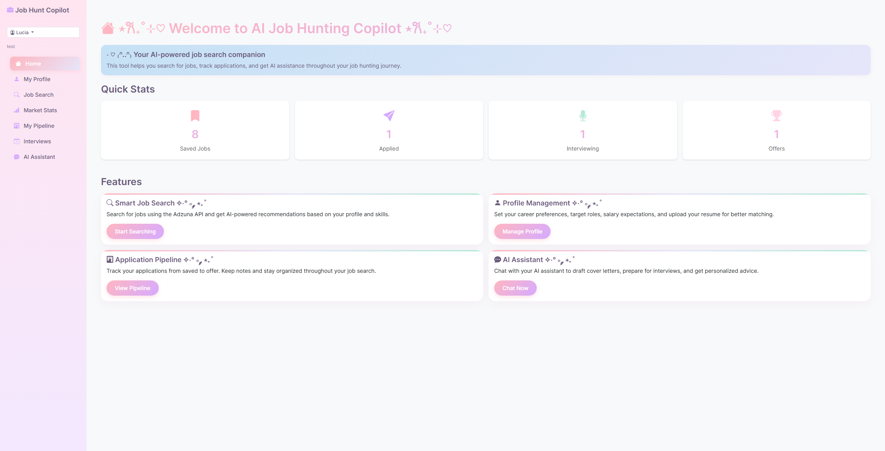
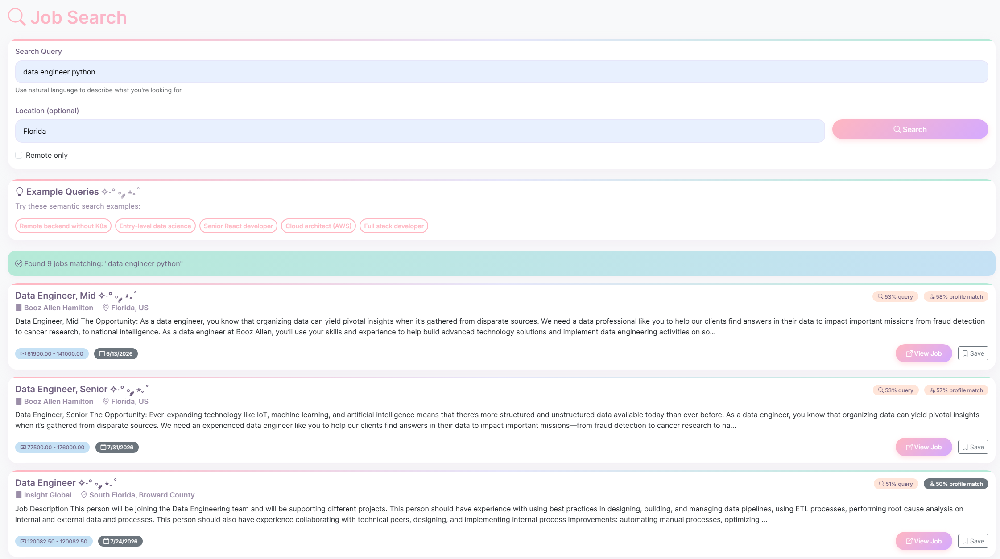
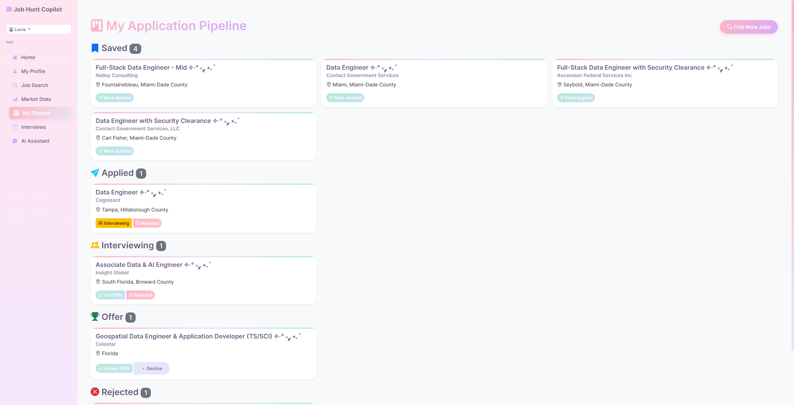
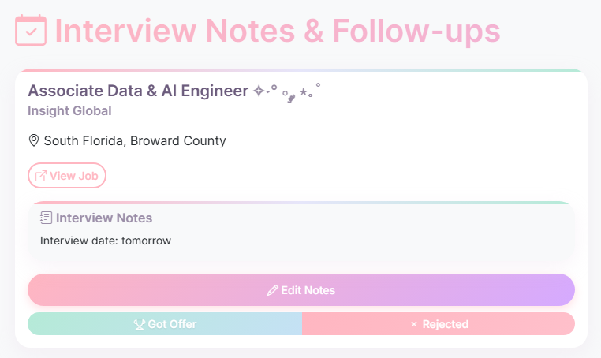
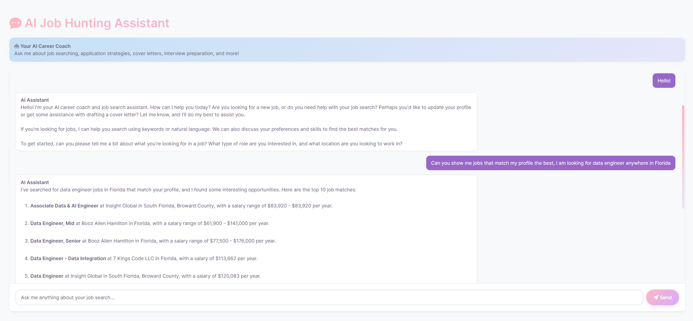
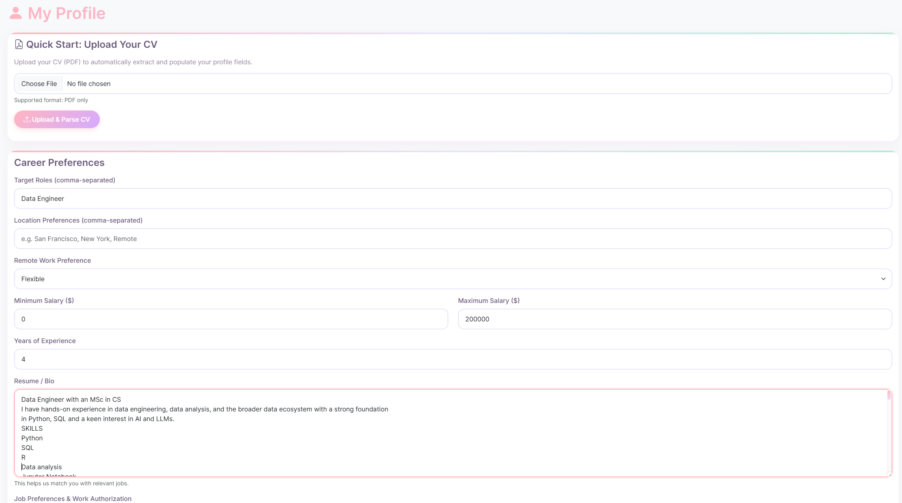
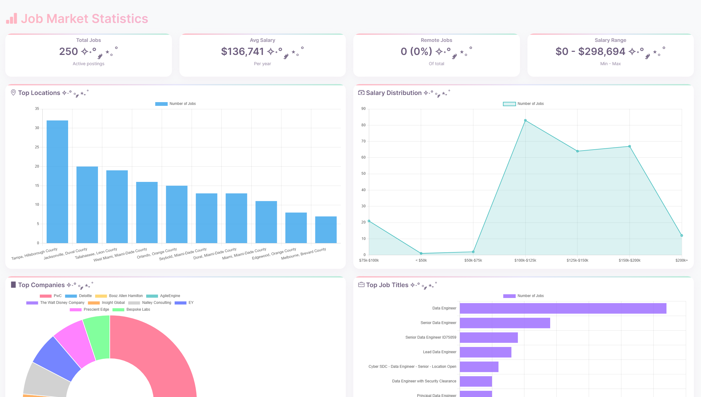

# AI Job Hunting Copilot - Databricks AI Capstone project

An AI-powered job search assistant built on Databricks, combining:
- **Lakebase** (Postgres) for structured data storage (see ```/sql``` for table definitions)
- **MCP Server** for AI agent tool integration (see ```/mcp_server```)
- **Flask** for user interaction
- **Adzuna API** for job search data (https://developer.adzuna.com/)
- CDF and data pipeline requirements were dropped as per instructions (not supported in free edition)
- Spark requirement was changed to spark OR using pysocpg2. Delta via Spark not required
- App.py is located in /dashboard, app.yaml set up to deploy it from there



## Features

### 🔍 Intelligent Job Search
- Search jobs via Adzuna API with natural language
- Semantic search using embeddings (job descriptions + user profile)
- AI-powered job ranking and match scoring




### 📊 Application Pipeline Tracking
- Track jobs through stages: saved → applied → interviewing → offer
- Interview notes and follow-up reminders
- Identify stale applications





### 💬 AI Assistant
- Ask questions in natural language
- Get job recommendations tailored to your profile
- Draft cover letters and resume bullets
- Prepare for interviews



### 👤 User Profile Management
- Upload CV and store resume and skills
- Add target roles, preferred locations, salary range, job preferences



### 📊 Job Market Stats
- Overview of the current market



## Setup Instructions

### 1. Get Adzuna API Credentials
1. Sign up at https://developer.adzuna.com/
2. Create an app to get App ID and App Key

### 2. Set up Lakebase
1. Create a Lakebase Postgres database in your Databricks workspace
2. Get the connection URL
3. Run the SQL

### 3. Configure Secrets
```bash
python setup_secrets.py
```

This will prompt for:
- Adzuna App ID and App Key
- Lakebase connection URL

### 4. Deploy Apps

- Deploy MCP Server in Databricks
- Deploy Dashboard in Databricks


### 5. Ingest Job Postings
Run the `dashboard/notebooks/ingest_job_embeddings` notebook to:
- Fetch jobs from Adzuna API
- Generate embeddings
- Store in Lakebase

Schedule this to run daily/weekly to refresh job listings.

### 6. Connect AI Agent
Register the MCP server URL with your Databricks AI Agent to enable tool calling.

- Complete tool reference with examples
- Conversational workflow patterns
- Best practices for semantic search and matching
- Error handling and multi-profile support

## Database Schema

### Core Tables
- **users** - User accounts
- **profiles** - Career preferences, resume, embeddings
- **job_postings** - Jobs from Adzuna with embeddings
- **applications** - Application pipeline tracking

## MCP Tools

The MCP server exposes these tools to AI agents:

### Job Search
- `search_jobs(keywords, location, remote_only, salary_min, results_per_page)`
- `get_job_categories()`

### Application Management
- `save_job(job_id, match_score, reasoning)` - Save a job to your pipeline
- `update_application_status(job_id, status, notes)` - Move jobs through stages (saved → applied → interviewing → rejected/offer)
- `get_my_applications(stage)` - Query all applications, optionally filtered by stage
- `get_cover_letter_context(job_id)` - Get structured job + profile data for AI-generated cover letters

### Profile Management
- `store_user_profile(resume_text, target_roles, skills, ...)` - Create/update user profile
- `get_user_info()` - Retrieve current user's profile and preferences


### Future Ideas 🔮
- Schedule a job to run daily, fetch new job postings, sends an email to the user (with the best matches)
- Add more Third-Party APIs (for job postings or company insights)

## Contributing

This is a capstone project. Suggestions and improvements welcome!

## License

MIT License - see LICENSE file for details
